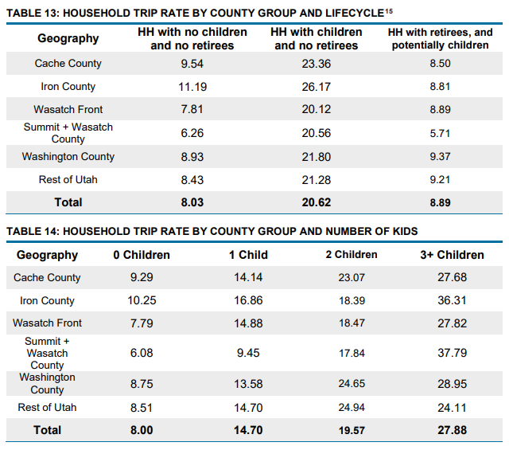

It was great talking with you and hearing about your assignment! Here are a few days of raw data showing active transportation counts. Keep in mind this is an intersection count, so anyone who passed through this intersection was counted. This breaks it down by mode and shows which direction people are coming from and going to, similar to how some vehicle traffic studies are done. The August 19th data shows a column for students, but the other two newer spreadsheets just count backpacks.

Something that also may be of interest I saw in the Utah Travel Survey was the correlation that the more kids that live in a household, the more trips that are made. This suggests that making our communities conducive to kids could both help increase their happiness through greater independence and cut down on the number of vehicle trips households are making currently by shuttling their kids to school and all their activities. Here are two tables on Page 26 of the survey report that show this:

Hopefully this is helpful and let me know if you have any questions on the data. If you think of it and want to share, it would be interesting to see your final assignment!
